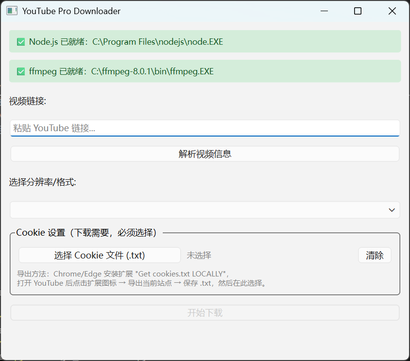

# YouTube Pro Downloader

一个基于 Python + PyQt6 的 YouTube 视频下载工具，支持选择分辨率、自动合并音视频、兼容 Windows 媒体播放器。


---

## 界面预览



---

## 功能特性

- 解析视频可用分辨率，自由选择画质
- 自动下载视频流 + 音频流，由 ffmpeg 合并为 mp4
- 音频优先使用 m4a（AAC）格式，Windows 媒体播放器原生支持
- 支持 Cookie 文件，可下载需要登录的视频
- 实时显示下载进度
- 异步下载，界面不卡顿

---

## 环境要求

| 依赖 | 版本要求 | 下载地址 |
|------|----------|----------|
| Python | 3.10+ | [python.org](https://www.python.org/downloads/) |
| Node.js | 任意 LTS 版本 | [nodejs.org](https://nodejs.org) |
| ffmpeg | 任意版本 | [gyan.dev](https://www.gyan.dev/ffmpeg/builds/) |

---

## 安装步骤

### 1. 安装 Python

从 [python.org](https://www.python.org/downloads/) 下载并安装 Python 3.10+。

> ⚠️ 安装时务必勾选 **"Add Python to PATH"**

### 2. 安装 Node.js

从 [nodejs.org](https://nodejs.org) 下载 LTS 版本安装，yt-dlp 解析 YouTube 视频格式时需要它。

安装完成后验证：
```bash
node -v
```

### 3. 安装 ffmpeg

1. 打开 [gyan.dev](https://www.gyan.dev/ffmpeg/builds/)，下载 `ffmpeg-release-essentials.zip`
2. 解压到任意目录，例如 `C:\ffmpeg`
3. 将 `C:\ffmpeg\bin` 添加到系统环境变量 `PATH`

添加完成后验证：
```bash
ffmpeg -version
```

### 4. 克隆项目

```bash
git clone https://github.com/TTDirection/DownYouTube.git
cd DownYouTube
```

### 5. 安装 Python 依赖

**推荐：使用 uv（更快）**

```bash
# 安装 uv
pip install uv

# 安装依赖
uv add yt-dlp PyQt6
```

**或使用 pip：**

```bash
pip install yt-dlp PyQt6
```

---

## 运行

```bash
# 使用 uv
uv run python yt_downloader.py

# 或直接使用 python
python yt_downloader.py
```

---

## 使用方法

### 基本下载流程

1. 粘贴 YouTube 视频链接
2. 选择已导出的 Cookie 文件（见下方说明）
3. 点击「解析视频信息」
4. 从下拉菜单选择分辨率
5. 点击「开始下载」

文件默认保存在**程序运行目录**。

---

## Cookie 设置（必须）

YouTube 目前对下载工具有访问限制，**必须提供浏览器 Cookie 才能正常下载**。请按以下步骤操作。

### 第一步：安装 Cookie 导出扩展

1. 打开 Chrome，在地址栏输入：
   ```
   https://chrome.google.com/webstore
   ```

2. 在搜索框输入：
   ```
   Get cookies.txt LOCALLY
   ```

3. 找到以下扩展：
   - **名称**：`Get cookies.txt LOCALLY`

   > ⚠️ 注意：不要安装其他名字相似的插件。

4. 点击「**添加到 Chrome**」完成安装

### 第二步：固定扩展图标（如果看不到图标）

Chrome 默认会隐藏扩展图标，按以下步骤将其固定：

1. 看浏览器右上角地址栏后面
2. 找到「**拼图**」图标 🧩 并点击
3. 在列表中找到 `Get cookies.txt LOCALLY`
4. 点击右侧「**图钉**」📌 图标
5. 扩展图标会固定显示在工具栏

### 第三步：导出 cookies.txt

1. 打开 [youtube.com](https://youtube.com) 并**登录你的账号**
2. 点击工具栏中的扩展图标
3. 选择「**导出当前站点**」
4. 将文件保存为 `.txt` 格式到本地

### 第四步：在程序中加载 Cookie

1. 启动 YouTube Pro Downloader
2. 点击「**选择 Cookie 文件 (.txt)**」
3. 选择刚才保存的 `.txt` 文件
4. 文件名显示为绿色表示加载成功

> ⚠️ Cookie 有有效期。若下载再次出现 403 错误，请重新导出 Cookie 文件。

---

## 项目结构

```
DownYouTube/
├── yt_downloader.py   # 主程序
├── assets/
│   └── screenshot.png # 界面截图
├── README.md
└── pyproject.toml     # 依赖配置（uv 管理）
```

---

## 常见问题

**Q：程序提示「Node.js 未检测到」**  
A：安装 Node.js 后重启终端和程序，确保 `node -v` 命令可以正常运行。

**Q：程序提示「ffmpeg 未检测到」**  
A：确认已将 ffmpeg 的 `bin` 目录加入系统 PATH，重启终端后重试。

**Q：下载失败，提示 HTTP 403**  
A：需要 Cookie 文件，按上方步骤导出后在程序中选择该文件。若已有 Cookie 文件仍然失败，说明 Cookie 已过期，请重新导出。

**Q：视频有画面但没有声音**  
A：确认 ffmpeg 已正确安装并加入 PATH，程序依赖 ffmpeg 合并音视频流。

**Q：首次下载速度很慢**  
A：首次运行时程序会从 GitHub 下载 EJS 挑战解析脚本（约几百 KB），下载后缓存到本地，后续不再重复下载。

---

## 技术栈

- [yt-dlp](https://github.com/yt-dlp/yt-dlp) — 视频下载核心
- [PyQt6](https://pypi.org/project/PyQt6/) — GUI 界面
- [ffmpeg](https://ffmpeg.org/) — 音视频合并
- [Node.js](https://nodejs.org) — yt-dlp JS 挑战解析运行时

---

## License

MIT